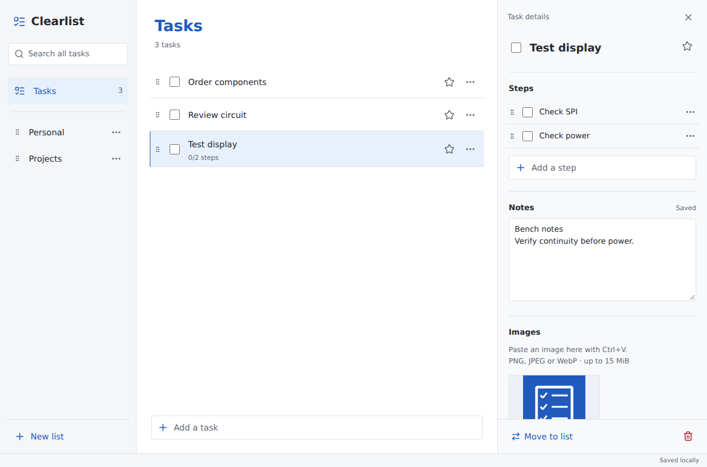
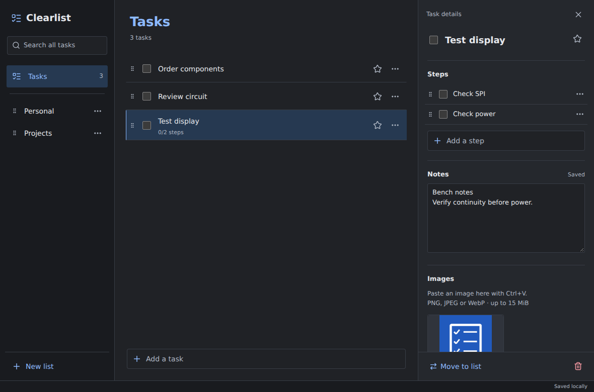
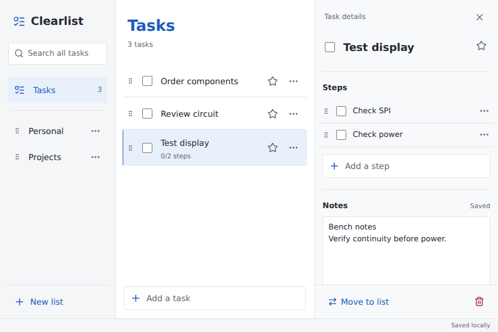

# Verification record

Deployment update, 18 September 2026: added `.github/workflows/windows-installer.yml` to build the NSIS installer on a Windows runner. This workflow has not been executed; GitHub connection is still required. No additional application tests were run for this deployment-only change.

Verified on 17 September 2026 in a Linux x86_64 workspace. This is a source delivery; no Windows executable or installer is included.

## Environment

| Tool                                    | Version |
| --------------------------------------- | ------- |
| Node.js                                 | 24.19.0 |
| npm                                     | 11.9.0  |
| Rust / Cargo                            | 1.98.1  |
| Tauri JS CLI                            | 2.11.4  |
| Chromium used for renderer smoke checks | 153     |

The npm and Cargo lockfiles are included. Core tests run against bundled SQLite in isolated temporary directories.

## Commands and outcomes

| Command                                                       | Actual result                                           |
| ------------------------------------------------------------- | ------------------------------------------------------- |
| `npm run format:check`                                        | Passed                                                  |
| `npm run lint`                                                | Passed with zero warnings                               |
| `npm run typecheck`                                           | Passed under strict TypeScript                          |
| `npm test`                                                    | Passed: 21 tests across 5 files                         |
| `cargo test`                                                  | Passed: 16 database/file integration tests              |
| `cargo fmt --all -- --check`                                  | Passed                                                  |
| `cargo clippy -p clearlist-core --all-targets -- -D warnings` | Passed                                                  |
| `npm run build`                                               | Passed: optimized frontend assets generated             |
| `cargo build -p clearlist-core --example test_bridge`         | Passed                                                  |
| `npm run tauri build`                                         | Blocked by missing Linux native dependencies; see below |

`cargo test` uses the workspace's `default-members` setting to test the persistence core without a native desktop SDK. It does not compile or certify the Tauri desktop host. `cargo test --workspace` additionally requires those native dependencies.

### Automated coverage

The 21 frontend tests cover title validation, duplicate identities, case-insensitive task/step/note search across lists, a 6,000-task search fixture, saved completion ordering, step ordering, clipboard extraction and validation, debounced notes and overlapping saves, retained failed drafts, serialized writes, error rollback, selection after moves/deletions, task/list interactions, keyboard menu reordering, inline-edit cancellation, image paste routing, and shutdown save/failure behavior.

The 16 Rust integration tests use real SQLite and files. They cover first-run migrations/default list protection, restart persistence, list/task/step CRUD, duplicate names, title validation, exact reorder membership, transactions and foreign keys, completion slots, repeated moves/reorders, original attachment bytes, PNG/JPEG/WebP validation and size limits, missing files and path validation, scoped orphan cleanup, cascades, independent duplicated images, failed metadata insertion rollback, file preservation when database deletion fails, unavailable storage, and the frontend camelCase command contract.

### Browser and core integration

The actual React renderer was exercised in headless Chromium at 1180 × 780 and 840 × 560. A test-only transport adapter sent commands to `crates/core/examples/test_bridge.rs`, which executes the same database repository used by the native host. The database and attachment files were real. Tauri window/IPC transport was substituted for this test; this was not a Windows WebView2 run.

Passed checks:

- First-run default Tasks list and creation of tasks/custom lists.
- Pointer and keyboard reordering of lists, tasks, and steps; step movement left parent task order unchanged.
- Cross-list pointer drop with selected-task details retained.
- Multiline note saving and synthetic clipboard image paste, file persistence, thumbnail, and in-app preview.
- Backend process restart and reopening the same data directory, retaining lists, order, notes, and image access.
- Attachment deletion and case-insensitive note search across lists.
- Light/dark rendering, the minimum supported viewport, and no horizontal document overflow at that size.
- No uncaught browser page errors during the smoke sequence.

Screenshots are renderer captures, without native Windows title bars:







## Native build limitation

The real command `CARGO_BUILD_JOBS=2 npm run tauri build` was attempted. Its frontend build completed. Rust then stopped in the Linux `glib-sys` build script:

```text
Could not run ... pkg-config --libs --cflags glib-2.0 'glib-2.0 >= 2.70'
The pkg-config command could not be found.
error: failed to run custom build command for glib-sys v0.18.1
```

Consequently, the desktop host compilation, real native launch, Windows executable, and NSIS installer have not been verified. The Linux environment also lacks Tauri's desktop development stack; installing only `pkg-config` would not establish a complete Windows build environment. The Windows build should be run natively with the prerequisites in the README. No signing certificate is configured.

## Windows acceptance checklist

Run these checks on the intended Windows machine before distributing a release:

1. Run `npm ci`, `npm run check`, `cargo fmt --all -- --check`, and `npm run tauri dev`. Confirm one native window appears; launching again focuses it.
2. Create several lists/tasks/steps, rename with Enter and blur, cancel with Escape, star and complete tasks, expand/collapse Completed, and confirm saved positions after uncompleting. Check pointer and keyboard ordering in both task sections.
3. Move and duplicate a task containing completed steps, multiline notes, and images. Delete one copy and confirm the other's images still open. Restart and confirm the data and order remain.
4. Use Ctrl+N, Ctrl+Shift+N, Ctrl+F, F2, menu arrow keys, Space/arrow drag controls, and Escape through menus/previews/editors/details. Confirm Delete in notes edits text and Delete outside text asks before deleting a task.
5. Paste a real screenshot from Windows Snipping Tool, a copied JPEG/WebP image, multiple image files when exposed by the source application, and copied HTML containing image files. Check plain-text paste, unsupported/oversized-image feedback, preview, and deletion. Clipboard representations vary by source application.
6. Type notes and immediately switch task or close the window. Reopen and confirm the final text. With a disposable development profile, verify an unavailable data directory produces a visible retry state. Restore any permissions changed during the check.
7. Check Windows light/dark mode, native titlebar, 100% and 150% display scaling, minimum window size, focus indicators, and screen-reader drag announcements.
8. Run `npm run tauri build`. Check `target\release\clearlist.exe` and the NSIS installer under `target\release\bundle\nsis`. Install for the current Windows account, launch offline after WebView2 setup, and confirm persistence across close/reopen and reinstall/update.

Back up the whole app-data directory before testing an existing profile. The development reset command backs up and resets only debug data, as documented in the README.
